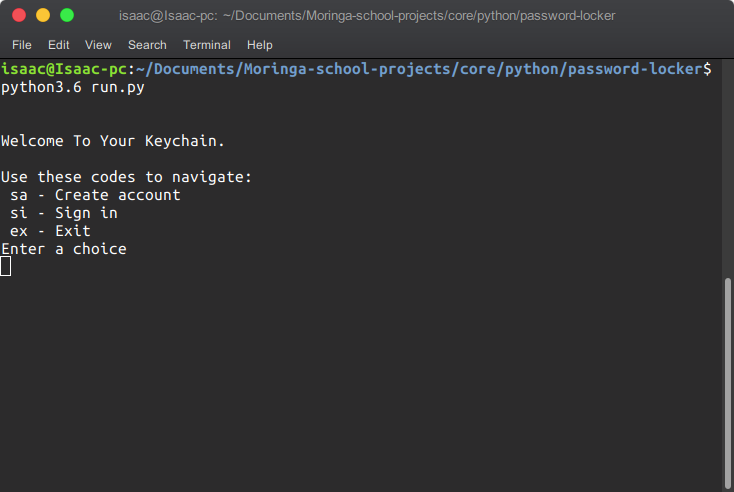

# Keychain

### Author
 **[Isaac Gichuru.](https://github.com/Isaacg94)**

## Description

A Python application that runs in the terminal that essentially allows a user to store, generate and copy log in credentials of different accounts.

## Features
* A feature to create a new account in order to access the app.
* A feature that takes in your username and password in order to create your account.
* An option to sign in to your account.
* A feature to create new credentials of an existing account in order to have them stored in the app.
* A feature to display your saved credentials.
* A feature to copy the password to the clipboard.
* A feature to delete saved credentials from the app.
* An option to exit the app.

## Short Codes
* **sa** : Create Account.
* **si** : Sign-in to Account.
* **sc** : Create Credential.
* **sd** : Display Credential.
* **sp** : Copy.
* **dl** : Delete.
* **ex** : Exit.

## Setup/Installation Requirements
Here is a run through of how to set up the application:
* Step 1 : Clone this repository using the git clone link:
  * **`git clone https://github.com/Isaacg94/password-locker.git`**
* Step 2 : Navigate to the directory:
  * **`cd password-locker`**
* Step 3 : Open the terminal, go to the project directory and run the following commands: chmod +x run.py and ./run.py respectively to launch the program.

## Technologies Used

- Python 3.6.8

## Support and contact details

Primary E-mail Address: 7248zack@gmail.com

### License
*MIT License* 

Copyright (c) 2019 **Isaac Gichuru**

